# 新型电力系统背景下，如何借力虚拟电厂如何 “玩转” 能源市场？

发布时间: 2025-05-14

文章链接: http://mp.weixin.qq.com/s?__biz=Mzk2NDk3ODY3OQ==&mid=2247486442&idx=1&sn=f49b1e4a7c40c11dbfe5e43cf945ccb8&chksm=c46a7972f31df06489ea65b30b5a99aa2a404d1222a5f2d482f5b4b05f6688ba4a99bf28bd47#rd

## 原文及图片

今天的文章开始之前，在这里我们也给大家分享一个消息：
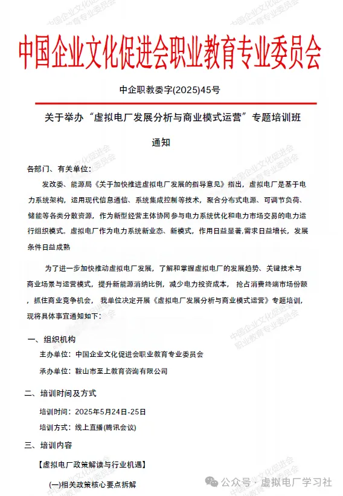

> ## 图片OCR结果
中国企业文化促进会职业教育专业委员会
中企职教委字（2025）45号
关于举办“虚拟电厂发展分析与商业模式运营”专题培训班
通知
各部门、有关单位：
发改委、能源局《关于加快推进虚拟电厂发展的指导意见》指出，虚拟电厂是基于电
力系统架构，运用现代信息通信、系统集成控制等技术，聚合分布式电源、可调节负荷、
储能等各类分散资源，作为新型经营主体协同参与电力系统优化和电力市场交易的电力运
行组织模式。虚拟电厂作为电力系统新业态、新模式，作用日益显著，需求日益增长，发展
条件日益成熟
为了进一步加快推动虚拟电厂发展，了解和掌握虚拟电厂的发展趋势、关键技术与
商业场景与运营模式，提升新能源消纳比例，减少电力投资成本，抢占消费终端市场份额
，抓住商业竞争机会，我单位决定开展《虚拟电厂发展分析与商业模式运营》专题培训
现将具体事宜通知如下：
一、组织机构
主办单位：中国企业文化促进会职业教育专业委员会
承办单位：鞍山市至上教育咨询有限公司
二、培训时间及方式
培训时间：2025年5月24日-25日
培训方式：线上直播（腾讯会议）
三、培训内容
【虚拟电厂政策解读与行业机遇】
（一）相关政策核心要点拆解
公众号虚拟电厂学习社

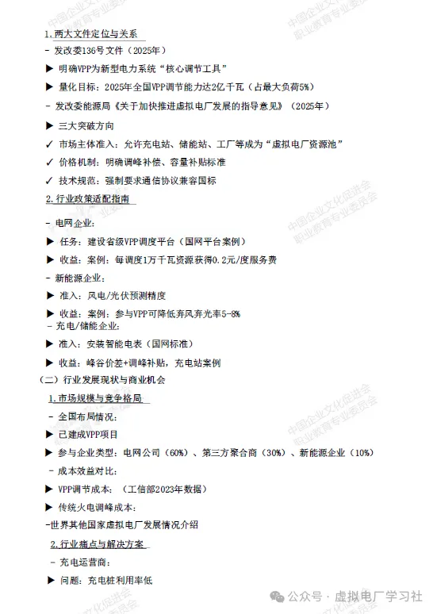

> ## 图片OCR结果
1.两大文件定位与关系
-发改委136号文件（2025年）
明确VPP为新型电力系统“核心调节工具”
量化目标：2025年全国VPP调节能力达2亿千瓦（占最大负荷5%）
-发改委能源局《关于加快推进虚拟电厂发展的指导意见》（2025年）
三大突破方向
√市场主体准入：允许充电站、储能站、工厂等成为“虚拟电厂资源池
价格机制：明确调峰补偿、容量补贴标准
√技术规范：强制要求通信协议兼容国标
2.行业政策适配指南
-电网企业：
任务：建设省级VPP调度平台（国网平台案例）
收益：案例：每调度1万千瓦资源获得0.2元/度服务费
-新能源企业：
准入：风电/光伏预测精度
收益：案例：参与VPP可降低弃风弃光率5-8%
-充电/储能企业：
准入：安装智能电表（国网标准）
收益：峰谷价差+调峰补贴，充电站案例
（二）行业发展现状与商业机会
1.市场规模与竞争格局
-全国布局情况：
已建成VPP项目
参与企业类型：电网公司（60%）、第三方聚合商（30%）、新能源企业（10%）
-成本效益对比：
VPP调节成本：（工信部2023年数据）
传统火电调峰成本：
一世界其他国家虚拟电厂发展情况介绍
2.行业痛点与解决方案
-充电运营商：
问题：充电柱利用率低
公众号·虚拟电厂学习社

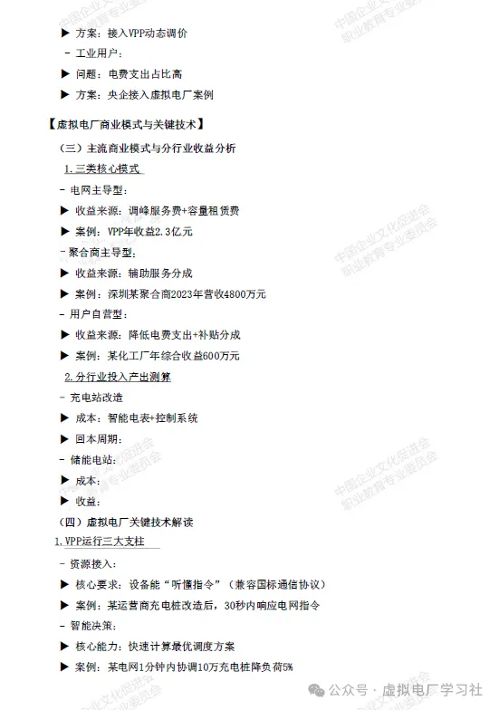

> ## 图片OCR结果
方案：接入VPP动态调价
-工业用户：
问题：电费支出占比高
方案：央企接入虚拟电厂案例
【虚拟电厂商业模式与关键技术】
（三）主流商业模式与分行业收益分析
1.三类核心模式
-电网主导型：
收益来源：调峰服务费+容量租赁费
案例：VPP年收益2.3亿元
-聚合商主导型：
X
收益来源：辅助服务分成
案例：深圳某聚合商2023年营收4800万元
-用户自营型：
收益来源：降低电费支出+补贴分成
案例：某化工厂年综合收益600万元
2.分行业投入产出测算
-充电站改造
成本：智能电表+控制系统
回本周期：
-储能电站：
成本：
收益：
（四）虚拟电厂关键技术解读
1.VPP运行三大支柱
-资源接入：
核心要求：设备能“听懂指令”（兼容国标通信协议）
案例：某运营商充电桩改造后，30秒内响应电网指令
-智能决策：
核心能力：快速计算最优调度方案
案例：某电网1分钟内协调10万充电桩降负荷5%
公众号·虚拟电厂学习社

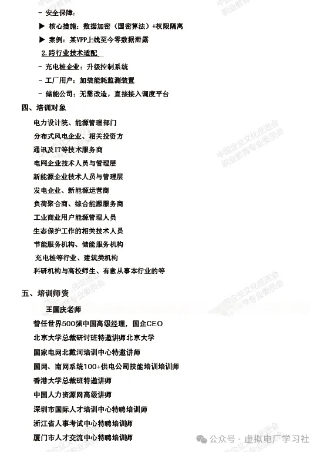

> ## 图片OCR结果
-安全保障：
核心措施：数据加密（国密算法）+权限隔离
案例：某VPP上线至今零数据泄露
2.跨行业技术适配
-充电桩企业：升级控制系统
-工厂用户：加装能耗监测装置
-储能公司：无需改造，直接接入调度平台
四、培训对象
电力设计院、能源管理部门
分布式风电企业、相关投资方
通讯及IT等技术服务商
电网企业技术人员与管理层
新能源企业技术人员与管理层
发电企业、新能源运营商
负荷聚合商、综合能源服务商
工业商业用户能源管理人员
生态保护工作的相关技术人员
节能服务机构、储能服务机构
充电桩等行业、建筑类机构
科研机构与高校师生、有意从事本行业的等
五、培训师资
王国庆老师
曾任世界500强中国高级经理，国企CEO
北京大学总裁研讨班特邀讲师北京大学
国家电网北戴河培训中心特邀讲师
国网、南网系统100+供电公司技能培训培训师
香港大学总裁班特邀讲师
中国人力资源网高级讲师
深圳市国际人才培训中心特聘培训师
浙江省人事考试中心特聘培训师
厦门市人才交流中心特聘培训师
公众号：虚拟电广学习社

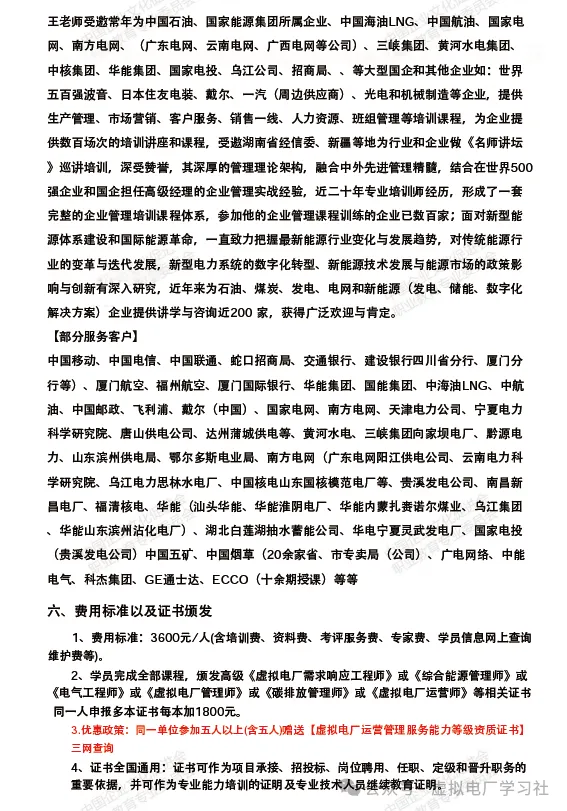

> ## 图片OCR结果
王老师受邀常年为中国石油、国家能源集团所属企业、中国海油LNG、中国航油、国家电
网、南方电网、（广东电网、云南电网、广西电网等公司）、三峡集团、黄河水电集团、
中核集团、华能集团、国家电投、乌江公司、招商局、、等大型国企和其他企业如：世界
五百强波音、日本住友电装、戴尔、一汽（周边供应商）、光电和机械制造等企业，提供
生产管理、市场营销、客户服务、销售一线、人力资源、班组管理等培训课程，为企业提
供数百场次的培训讲座和课程，受邀湖南省经信委、新疆等地为行业和企业做《名师讲坛
》巡讲培训，深受赞誉，其深厚的管理理论架构，融合中外先进管理精髓，结合在世界500
强企业和国企担任高级经理的企业管理实战经验，近二十年专业培训师经历，形成了一套
完整的企业管理培训课程体系，参加他的企业管理课程训练的企业已数百家：面对新型能
源体系建设和国际能源革命，一直致力把握最新能源行业变化与发展趋势，对传统能源行
业的变革与选代发展，新型电力系统的数字化转型、新能源技术发展与能源市场的政策影
响与创新有深入研究，近年来为石油、煤炭、发电、电网和新能源（发电、储能、数字化
解决方案）企业提供讲学与咨询近200家，获得广泛欢迎与肯定。
【部分服务客户】
中国移动、中国电信、中国联通、蛇口招商局、交通银行、建设银行四川省分行、厦门分
行等）、厦门航空、福州航空、厦门国际银行、华能集团、国能集团、中海油LNG、中航
油、中国邮政、飞利浦、戴尔（中国）、国家电网、南方电网、天津电力公司、宁夏电力
科学研究院、唐山供电公司、达州蒲城供电等、黄河水电、三峡集团向家坝电厂、黔源电
力、山东滨州供电局、鄂尔多斯电业局、南方电网（广东电网阳江供电公司、云南电力科
学研究院、乌江电力思林水电厂、中国核电山东国核模范电厂等、贵溪发电公司、南昌新
昌电厂、福清核电、华能（汕头华能、华能淮阴电厂、华能内蒙扎赛诺尔煤业、乌江集团
、华能山东滨州沾化电厂）、湖北白莲湖抽水蓄能公司、华电宁夏灵武发电厂、国家电投
（贵溪发电公司）中国五矿、中国烟草（20余家省、市专卖局（公司）、广电网络、中能
电气、科杰集团、GE通士达、ECCO（十余期授课）等等
六、费用标准以及证书颁发
1、费用标准：3600元/人（含培训费、资料费、考评服务费、专家费、学员信息网上查询
维护费等)。
2、学员完成全部课程，颁发高级《虚拟电厂需求响应工程师》或《综合能源管理师》或
《电气工程师》或《虚拟电厂管理师》或《碳排放管理师》或《虚拟电厂运营师》等相关证书
同一人申报多本证书每本加1800元。
3.优惠政策：同一单位参加五人以上（含五人赠送【虚拟电厂运营管理服务能力等级资质证书】
三网查询
4、证书全国通用：证书可作为项目承接、招投标、岗位聘用、任职、定级和晋升职务的
重要依据，并可作为专业能力培训的证明及专业技术人员继续教育证明拟电厂学习社

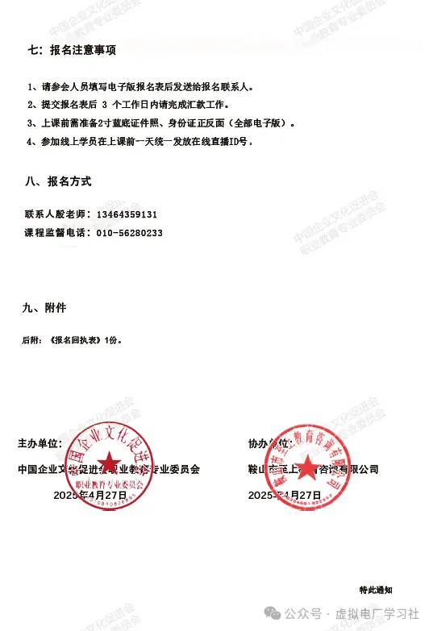

> ## 图片OCR结果
七：报名注意事项
1、请参会人员填写电子版报名表后发送给报名联系人。
2、提交报名表后3个工作日内请完成汇款工作。
3、上课前需准备2寸蓝底证件照、身份证正反面（全部电子版）。
4、参加线上学员在上课前一天统一发放在线直播ID号，
八、报名方式
联系人股老师：13464359131
课程监督电话：010-56280233
九、附件
后附：
《报名回执表》1份。
教育
主办单位：
协办
位
ET
范促进业教专业委员会
市
中国企业文
鞍山
上
咨询有
限公司
职业教育专业委员会
2025年4月27日。
2025-
24月27日
54108
特此通知
公众号·虚拟电厂学习社

2025年，很多企业都在上马虚拟电厂业务，如果你们还不了解，建议大家多学习学习。三重福利，大家看看哪个适合你：
第一份附赠礼物：
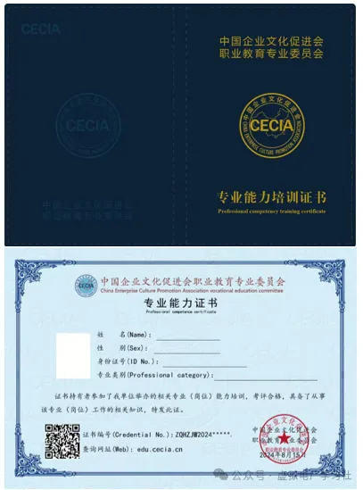

> ## 图片OCR结果
CECIA
中国企业文化促进会
职业教育专业委员会
文店
CECIA
CECIA
专业能力培训证书
Profewionsdcopcieeyfainingcertifeatr
中国企业文化促进会职业教育专业委员会
专业能力证书
名（Name）
性
别（Sex）:
身份证号（1DNo.）：
专业类别（Professionalcategory）：
证书持有者参加了我单位举办的相关专业（商位）能力培训，考评合格，具备了从事
该专业（岗位）工作的相关如识，特发此证。
编号（Credentia1No.）：ZQHZJ2024**
网M（eb）：edu.cecia.cn

第二份是面向企业端的：
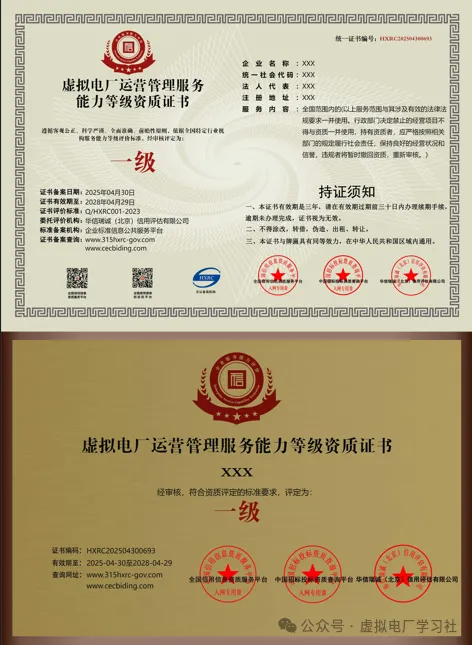

> ## 图片OCR结果
统一证书编号：HXRC2250439
2
企业名称：XXX
虚拟电厂运营管理服务
统一社会代码：XXX
法人代表：xXx
能力等级资质证书
注册地址
服务内容：全国范围内的以上服务范围与其涉及有效的法律法
规要求一并使用，行改部门决定禁止的经营项目不
L
遵客公正.H学严语
服务方等线价
控中核F定为
全国定行业机
得与资质一并使用，持有资质者，应严格技照相关
部门的规定履行社会责任，保持良好的经营状况和
级
信营，违规者将暂时撤回资质，重新审核。）
证书备案日期：2025年04月30日
持证须知
证书有效期至：2028年04月29日
证书评价标准：Q/HXRC001-2023
本证书有效期是三年，请在有效期过期前三十日内办理续期手续
委托评价机构：华信瑞诚（北京）信用评估有限公司
逾期未办理完成，证书视为无效，
标准备案机构：企业标准信息公共服务平台
二、不得涂改，转值，伪造，出租、转让。
L
证书备案查询：
www.315hxrc-gov.com
www.cecbiding.com
三、本证书与牌具有同等效力，在中华人民共和国区域内通用，
虚拟电厂运营管理服务能力等级资质证书
XXX
经审核：符合资质评定的标准要求，评定为：
级
证书编码：HXRC202504300693
有效期至：2025-04-30至2028-04-29
查询网址：www.315hrc-gov.com
www.cecbiding.com
信用信声质服务
有限公司
人用用
公众号·虚拟电厂学习社

第三份，给广大学员们开通的虚拟电厂知识星球平台，上面几百份学习资料可以免费下载
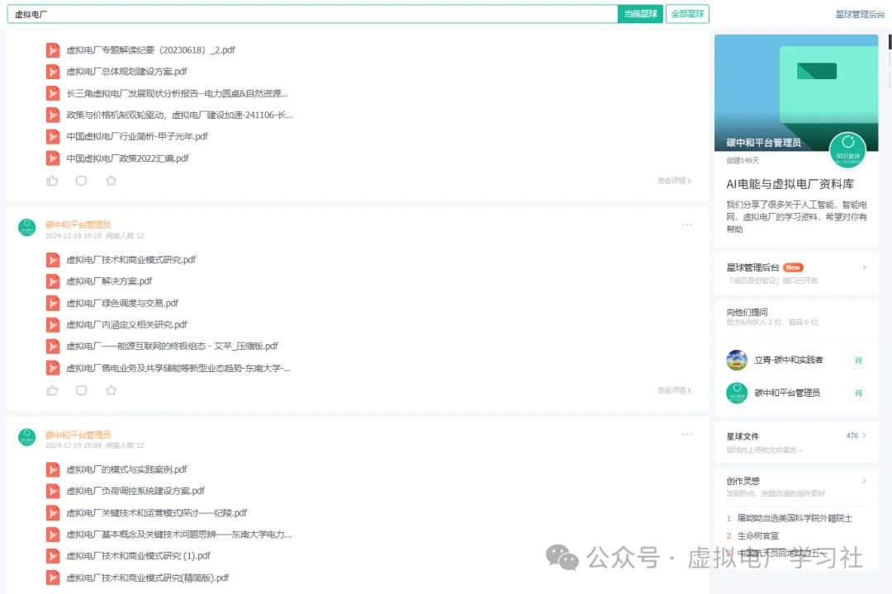

> ## 图片OCR结果
虚拟电厂
全部星球
星球管理后台
虚拟电厂专题解读纪要（20230618）_2.pdf
虚拟电厂总体规划建设方案.pdf
长三角虚拟电厂发展现状分析报告--电力圆点&自然资源.
政策与价格机制双轮驱动，虚拟电厂建设加速-241106-长...
中国虚拟电厂行业简析-甲子光年.pdf
碳中和平台管理员
中国虚拟电厂政策2022汇编.pdf
创建140天
心
查吞详情>
AI电能与虚拟电厂资料库
我们分享了很多关于人工智能，智能电
碳中和平台管理员
网，虚拟电厂的学习资料，希望对你有
2024-12-1919110读人数12
帮助
虚拟电厂技术和商业模式研究.pdf
星球管理后台
New
虚拟电厂解决方案.pdf
「成员身份验证]接口已开放
虚拟电厂绿色调度与交易.pdf
向他们提问
虚拟电厂内涵定义相关研究.pdf
星8合伙人2位，充宾0位
虚拟电厂
一能源互联网的终极组态-艾芊_压缩版.pdf
立青-碳中和实践者
F
虚拟电厂售电业务及共享储能等新型业态趋势-东南大学-
心
宣看详情>
碳中和平台管理员
联中和平台管理员
星球文件
476 >
2024-12-19 19:09 同读人数 12
星球内上传的文件生合
虚拟电厂的模式与实践案例.pdf
创作灵感
虚拟电厂负荷调控系统建设方案.pdf
发现热点：控经合适的创作素材
虚拟电厂关键技术和运营模式探讨一—纪陵.pdf
1居助呦当选美国科学院外籍院士
虚拟电厂基本概念及关键技术问题思辨东南大学电力.
2生命树官宣
虚拟电厂技术和商业模式研究（1）.pdf
虚拟电厂技术和商业模式研究（精简版）.pdf

这是一个不容错过的分享，你一定要多关注。

> ## 图片OCR结果
口
口
口

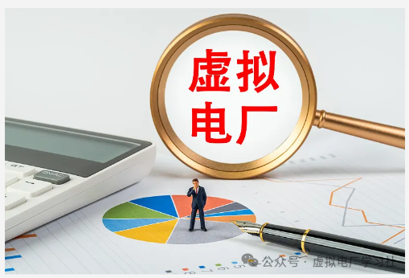

> ## 图片OCR结果
虚拟
电厂
公众号

一、能源转型的新挑战：电力平衡的难题
现在，我们都知道要搞能源绿色低碳转型，实现 “碳达峰・碳中和”，大力发展风电、光伏发电这些新能源，构建新型电力系统就是关键一步。你看，预计到 2030 年，咱们国家风光总装机容量会超 1200GW，成为装机的主力军；到 2060 年，风光发电量占比能超一半，变成电量的主要来源。
但这也带来了新问题。风光发电虽然好，可它们太不稳定了，随机性和间歇性特别强。一会儿风大一会儿风小，太阳也不是一直都能照着，这就让发电变得很难预测。这么一来，电力电量平衡就成了大难题，以前 “源随荷动” 的老办法根本行不通了，严重影响了新型电力系统的安全稳定运行。
为了维持电力系统的功率平衡，就得让系统更灵活，能快速调节功率。一般来说，可以多建抽水蓄能电站、新型储能电站，或者改造煤电让它们更灵活。不过，这些办法成本可不低，建设、运维、改造、启停都要花不少钱。所以，大家就把目光投向了需求响应，它能挖掘用户侧柔性负荷的潜力，成本相对较低，是提升系统灵活性的好办法，能促进 “源荷互动”，对构建新型电力系统特别重要。但新的问题又来了，怎么把用户侧那些海量、分散、多元的分布式资源聚合起来，让它们协同调度，还得找个合适的主体来推动大规模的需求响应，这可把大家难住了。
二、虚拟电厂登场：能源管理的新希望
在这种情况下，虚拟电厂就出现了，它就像是电力系统的 “智慧大脑”，能解决不少难题。虚拟电厂可不是真正的电厂，它是用先进的通信、量测、控制技术和软件系统把分布式电源、储能、可控负荷、电动汽车等这些分布式资源聚在一起，组成的一个虚拟联合体。
虽然这些资源在空间上是分散的，不是一个集中的大工厂，但它们能协同工作，发挥出和电厂一样的功能，所以才叫虚拟电厂。它的控制结构有集中控制和分散控制两种。集中控制就像军队听指挥一样，调度中心统一发号施令；分散控制呢，是把虚拟电厂分成一个个能相互通信、自己管理自己的子系统，大家一起合作完成任务。
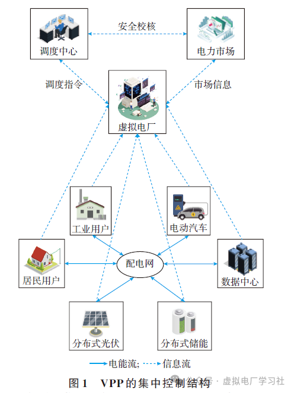

> ## 图片OCR结果
安全校核
调度中心
电力市场
调度指令
市场信息
虚拟电厂
工业用户
电动汽车
配电网
居民用户
数据中心
分布式光伏
分布式储能
电能流；·---信息流
图1
VPP的集中控制结构
·虚拟电厂学习社

《
乘电改东风，虚拟电厂迎发展机遇期.pdf》

> ## 图片OCR结果
乘“电改”东风，虚拟电厂迎发展机遇期
虚拟电厂行业深度报告
公众号·虚拟电厂学习社

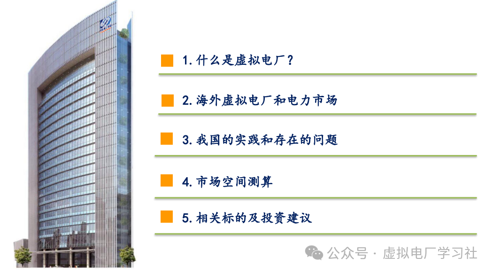

> ## 图片OCR结果
1.什么是虚拟电厂？
2.海外虚拟电厂和电力市场
3.我国的实践和存在的问题
4.市场空间测算
5.相关标的及投资建议
公众号·虚拟电厂学习社

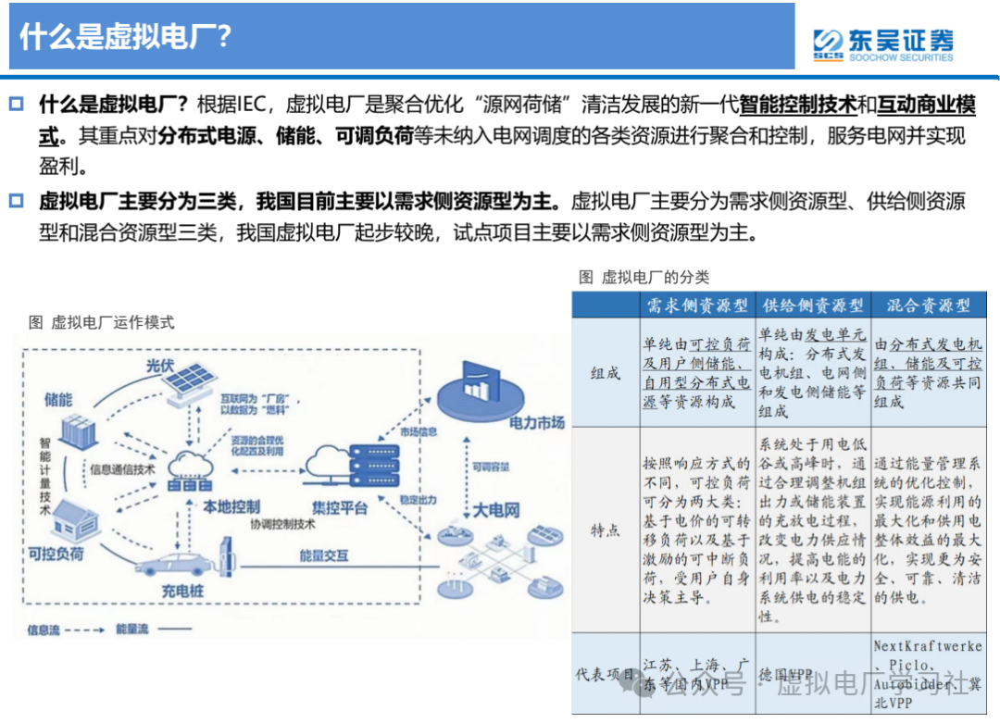

> ## 图片OCR结果
什么是虚拟电厂？
东吴证券
SOOCHOWSECURITIES
什么是虚拟电厂？根据IEC，虚拟电厂是聚合优化“源网荷储”清洁发展的新一代智能控制技术和互动商业模
式。其重点对分布式电源、储能、可调负荷等未纳入电网调度的各类资源进行聚合和控制，服务电网并实现
盈利。
虚拟电厂主要分为三类，我国目前主要以需求侧资源型为主。虚拟电厂主要分为需求侧资源型、供给侧资源
型和混合资源型三类，我国虚拟电厂起步较晚，试点项目主要以需求侧资源型为主。
图虚拟电厂的分类
需求侧资源型
供给侧资源型
混合资源型
图虚拟电厂运作模式
单纯由发电单元
单纯由可控负荷
由分布式发电机
构成：分布式发
光伏
及用户侧储能、
组、储能及可控
组成
电机组、电网侧
自用型分布式电
和发电侧储能等
负荷等资源共同
储能
互联网为
源等资源构成
组成
组成
以数据为
电力市场
盗源的合理优
智
系统处于用电低
能计量
信息通信技术
可调容量
按照响应方式的谷或高峰时，通通过能量管理系
电电房
不同，可控负荷过合理调整机组统的优化控制，
技
术
本地控制
集控平台
稳定出力
大电网
可分为两大类：出力或储能装置
实现能源利用的
协调控制技术
基于电价的可转的充放电过程，
最大化和供用电
特点
移负荷以及基于改变电力供应情整体效益的最大
可控负荷
能量交互
激励的可中断负况，提高电能的化，实现更为安
荷，受用户自身利用率以及电力全、可靠、清洁
充电桩
决策主导。
系统供电的稳定的供电。
性。
NextKraftwerke
江苏、上海、广
Piclo.
Autobidde过翼
北VPP

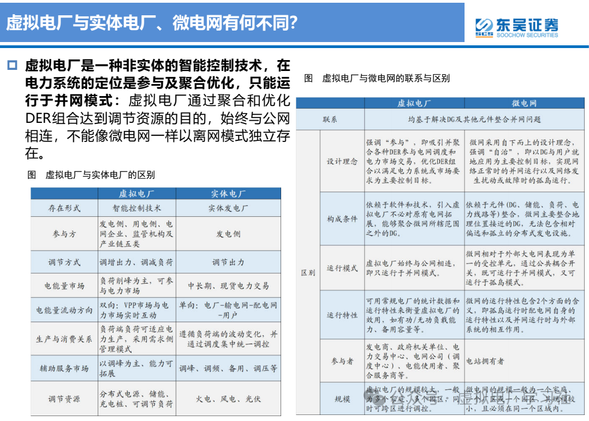

> ## 图片OCR结果
虚拟电厂与实体电厂、微电网有何不同？
东吴证券
SOOCHOWSECURITIES
口
虚拟电厂是一种非实体的智能控制技术，在
电力系统的定位是参与及聚合优化，只能运
冬
虚拟电厂与微电网的联系与区别
行于并网模式：虚拟电厂通过聚合和优化
虚拟电厂
微电网
DER组合达到调节资源的目的，始终与公网
联系
均基于解决DG及其他元件整合并网问题
相连，不能像微电网一样以离网模式独立存
强调“参与”，即吸引并聚
微网采用自下而上的设计理念，
在。
合各种DER参与电网调度和
强调“自治”，即以DG与用户就
设计理念
电力市场交易，优化DER组
地应用为主要控制目标，实现网
图虚拟电厂与实体电厂的区别
合以满足电力系统或市场要
络正常时的并网运行以及网络发
求为主要控制目标。
生扰动或故障时的孤岛运行。
虚拟电厂
实体电厂
存在形式
智能控制技术
实体发电厂
依赖于软件和技术，引入虚
依赖于元件（DG、储能、负荷、电
构成条件
拟电厂不必对原有电网拓
力线路等）整合，微网主要整合地
发电侧、用电侧、电
展，能够聚合微网所辖范围
理位置接近的DG，无法包含相对
参与方
网企业、监管机构及
发电侧
之外的DG。
偏远和孤立的分布式发电设施。
产业链五类
微网相对于外部大电网表现为单
调节方式
调增出力、调减负荷
调节出力
运行模式
虚拟电厂始终与公网相连，
一的受控单元，通过公共耦合开
区别
即只运行于并网模式。
关，既可运行于并网模式，又可
电能量市场
负荷削峰为主，可参
中长期、现货电力交易
运行于孤岛模式。
与电力市场
双向：VPP市场与电
单向：电厂-输电网-配电网
可用常规电厂的统计数据和
微网的运行特性包含2个方面的含
电能量流动方向
力市场实时互动
一用户
运行特性
运行特性来衡量虚拟电厂的
义，即孤岛运行时配电网自身的
效用，如有功/无功负载能
运行特性以及并网运行时与外部
负荷端负荷可适应电
遵循负荷端的波动变化，并
力、备用容量等。
系统的相互作用。
生产与消费关系
力生产，采用需求侧
管理模式
通过调度集中统一调控
发电商、政府机关单位、电
以调峰为主、能力可
参与者
力交易中心、电网公司（调
度中心）、电能使用者、聚
电站拥有者
辅助服务市场
拓展
调峰、调频、备用、调压等
合服务商等。
虚拟电厂的规模较大，
一般
微电网的规模一般为一个家庭、
调节资源
分布式电源、储能、
火电、风电、光伏
规模
为多个家庭、人多个国区，同不大区域十个国区，共规模较
充电桩、可调节负荷
时可跨区进行调控
小，且必须在同一个区域内。

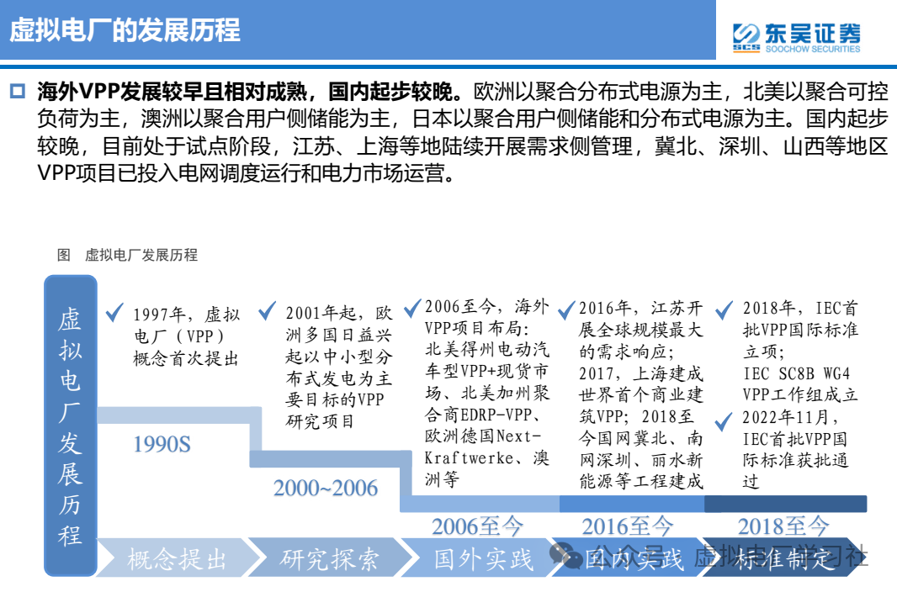

> ## 图片OCR结果
虚拟电厂的发展历程
东吴证券
SOOCHOWSECURITIES
海外VPP发展较早且相对成熟，国内起步较晚。欧洲以聚合分布式电源为主，北美以聚合可控
负荷为主，澳洲以聚合用户侧储能为主，日本以聚合用户侧储能和分布式电源为主。国内起步
较晚，目前处于试点阶段，江苏、上海等地陆续开展需求侧管理，冀北、深圳、山西等地区
VPP项目已投入电网调度运行和电力市场运营
图虚拟电厂发展历程
1997年，虚拟
2001年起，欧
√2006至今，海外√2016年，江苏开
2018年，IEC首
虚
拟电厂发展历程
VPP项目布局：
洲多国日益兴
展全球规模最大
批VPP国际标准
电厂（VPP）
起以中小型分
北美得州电动汽
概念首次提出
的需求响应；
立项；
布式发电为主
车型VPP+现货市
2017，上海建成
IEC SC8B WG4
场、北美加州聚
世界首个商业建
VPP工作组成立
要目标的VPP
研究项目
合商EDRP-VPP、
筑VPP；2018至
2022年11月，
1990S
欧洲德国Next-
今国网冀北、南
IEC首批VPP国
Kraftwerke、澳
网深圳、丽水新
际标准获批通
洲等
2000~2006
能源等工程建成
过
2006至今
2016至今
2018至今
概念提出
研究探索
国外实践
国内实践
棕准制定

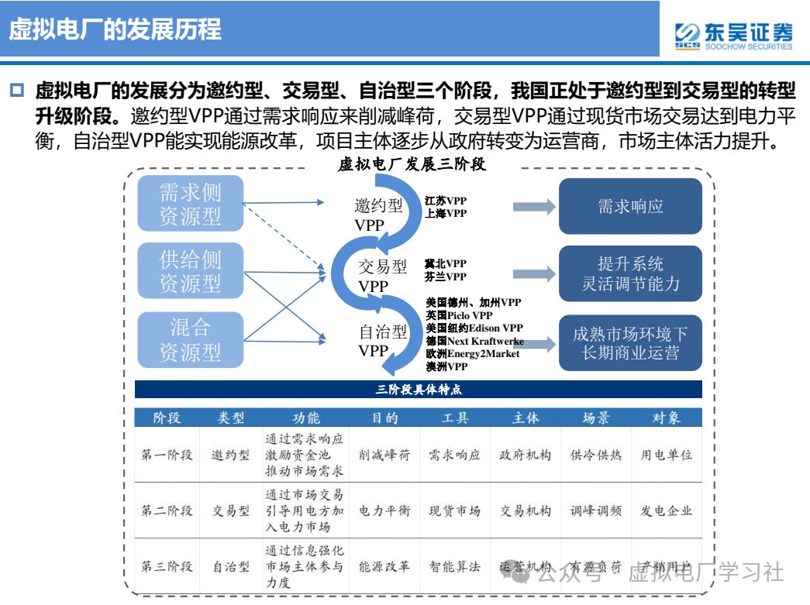

> ## 图片OCR结果
虚拟电厂的发展历程
东吴证券
SOOCHOWSECURITIES
■
虚拟电厂的发展分为邀约型、交易型、自治型三个阶段，我国正处于邀约型到交易型的转型
升级阶段。邀约型VPP通过需求响应来削减峰荷，交易型VPP通过现货市场交易达到电力平
衡，自治型VPP能实现能源改革，项目主体逐步从政府转变为运营商，市场主体活力提升。
虚拟电厂发展三阶段
需求侧
邀约型
江苏VPP
需求响应
资源型
上海VPP
VPP
供给侧
交易型
冀北VPP
提升系统
资源型
芬兰VPP
VPP
灵活调节能力
美国德州、加州VPP
混合
英国PicloVPP
自治型
美国纽约EdisonVPP
成熟市场环境下
德国NextKraftwerke
资源型
VPP
欧洲Energy2Market
长期商业运营
澳洲VPP
三阶段具体特点
阶段
类型
功能
目的
工具
主体
场景
对象
通过需求响应
第一阶段
邀约型
激励资金池
削减峰荷
需求响应
政府机构
供冷供热
用电单位
推动市场需求
通过市场交易
第二阶段
交易型
引导用电方加
电力平衡
现货市场
交易机构
调峰调频
发电企业
入电力市场
通过信息强化
第三阶段
自治型
市场主体参与
能源改革
智能算法
运营机构负荷虚绑电厂学习社
力度

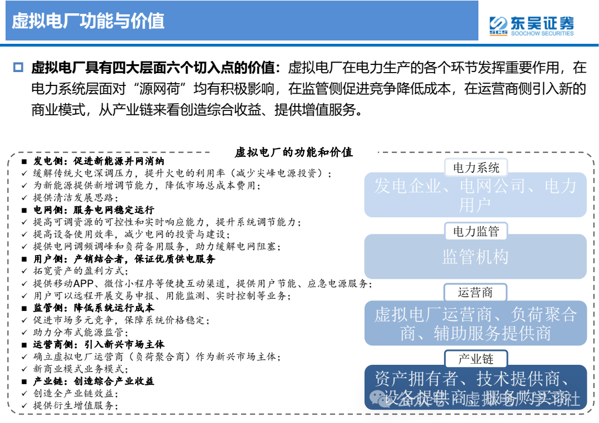

> ## 图片OCR结果
虚拟电厂功能与价值
东吴证券
SOOCHOWSECURITIES
口虚拟电厂具有四大层面六个切入点的价值：虚拟电厂在电力生产的各个环节发挥重要作用，在
电力系统层面对“源网荷”均有积极影响，在监管侧促进竞争降低成本，在运营商侧引入新的
商业模式，从产业链来看创造综合收益、提供增值服务。
虚拟电厂的功能和价值
■发电侧：促进新能源并网消纳
电力系统
√缓解传统火电深调压力，提升火电的利用率（减少尖峰电源投资）；
√为新能源提供新增调节能力，降低市场总成本费用；
发电企业、电网公司、电力
√提供清洁发展思路：
用户
■电网侧：服务电网稳定运行
√提高可调资源的可控性和实时响应能力，提升系统调节能力；
√提高设备使用效率，减少电网的投资与建设；
电力监管
√提供电网调频调峰和负荷备用服务，助力缓解电网阻塞；
监管机构
■用户侧：产销结合者，保证优质供电服务
√拓宽资产的盈利方式；
√提供移动APP、微信小程序等便捷互动渠道，提供用户节能、应急电源服务；
运营商
√用户可以远程开展交易申报、用能监测、实时控制等业务；
■监管侧：降低系统运行成本
虚拟电厂运营商、负荷聚合
√促进市场多元竞争，保障系统价格稳定；
√助力分布式能源监管；
商、辅助服务提供商
■运营商侧：引入新兴市场主体
√确立虚拟电厂运营商（负荷聚合商）作为新兴市场主体；
产业链
√新商业模式业务模式；
■产业链：创造综合产业收益
资产拥有者、技术提供商
√创造全产业链效益；
设备提耕商虚搬务购实社
√提供衍生增值服务；

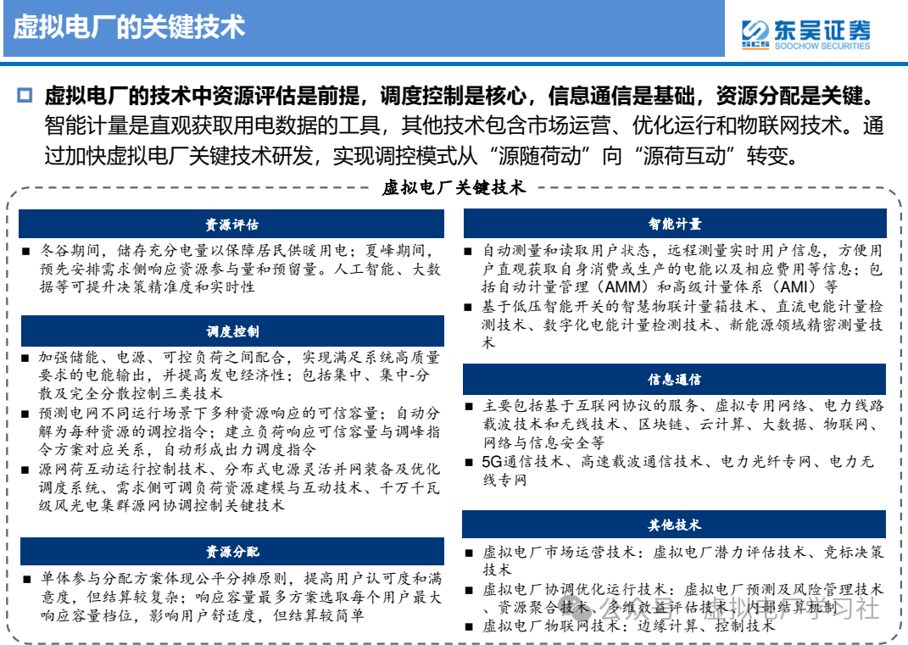

> ## 图片OCR结果
虚拟电厂的关键技术
东吴证券
SOOCHOWSECURIT
口虚拟电厂的技术中资源评估是前提，调度控制是核心，信息通信是基础，资源分配是关键。
智能计量是直观获取用电数据的工具，其他技术包含市场运营、优化运行和物联网技术。通
过加快虚拟电厂关键技术研发，实现调控模式从“源随荷动”向“源荷互动”转变。
一一一虚拟电厂关键技术-一一
资源评估
智能计量
冬谷期间，储存充分电量以保障居民供暖用电；夏峰期间，
■自动测量和读取用户状态，远程测量实时用户信息，方便用
预先安排需求侧响应资源参与量和预留量。人工智能、大数
户直观获取自身消费或生产的电能以及相应费用等信息；包
据等可提升决策精准度和实时性
括自动计量管理（AMM）和高级计量体系（AMI）等
■基于低压智能开关的智慧物联计量箱技术、直流电能计量检
调度控制
测技术、数字化电能计量检测技术、新能源领域精密测量技
术
1加强储能、电源、可控负荷之间配合，实现满足系统高质量
要求的电能输出，并提高发电经济性；包括集中、集中-分
信息通信
散及完全分散控制三类技术
■主要包括基于互联网协议的服务、虚拟专用网络、电力线路
1预测电网不同运行场景下多种资源响应的可信容量；自动分
载波技术和无线技术、区块链、云计算、大数据、物联网、
解为每种资源的调控指令；建立负荷响应可信容量与调峰指
网络与信息安全等
令方案对应关系，自动形成出力调度指令
源网荷互动运行控制技术、分布式电源灵活并网装备及优化
■5G通信技术、高速载波通信技术、电力光纤专网、电力无
线专网
调度系统、需求侧可调负荷资源建模与互动技术、千万千瓦
级风光电集群源网协调控制关键技术
其他技术
资源分配
■
虚拟电厂市场运营技术：虚拟电厂潜力评估技术、竞标决策
技术
■单体参与分配方案体现公平分摊原则，提高用户认可度和满
意度，但结算较复杂；响应容量最多方案选取每个用户最大
■虚拟电厂协调优化运行技术：虚拟电厂预测及风险管理技术
、资源聚合技术、多维效益评估技抄内部结算桃制习社
响应容量档位，影响用户舒适度，但结算较简单
■虚拟电厂物联网技术：边缘计算、控制技术

《
分布式资源虚拟电厂运行控制技术展望.pdf》
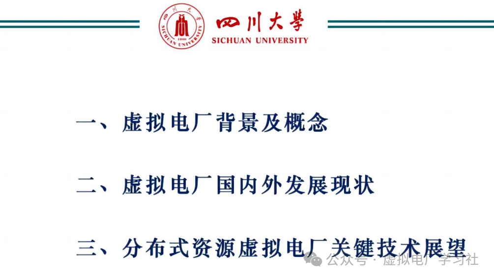

> ## 图片OCR结果
网川大学
SICHUANUNIVERSITY
UNI
虚拟电厂背景及概念
二、虚拟电厂国内外发展现状
三、分布式资源虚拟电厂关键技术展望
社
虚以电

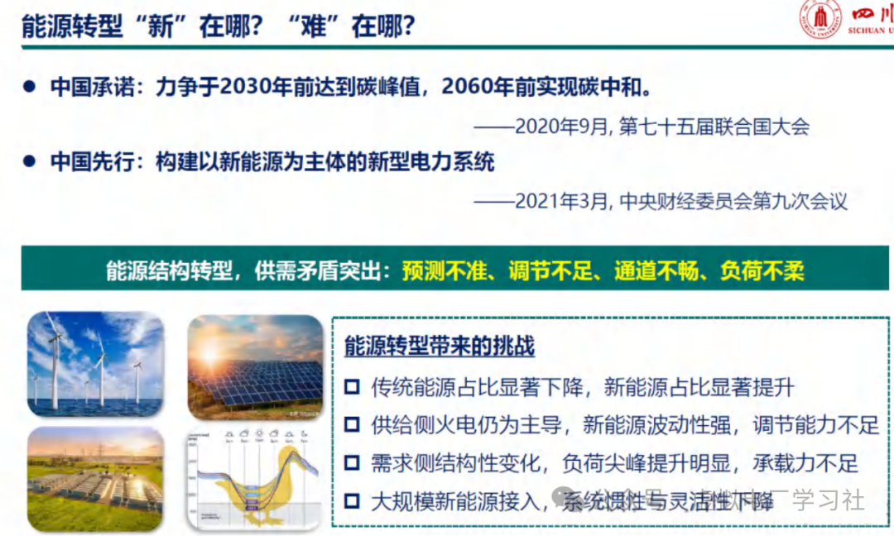

> ## 图片OCR结果
“难”在哪？
?川
能源转型“新”在哪？
SICHUAN
中国承诺：力争于2030年前达到碳峰值，2060年前实现碳中和
2020年9月，第七十五届联合国大会
中国先行：构建以新能源为主体的新型电力系统
2021年3月，中央财经委员会第九次会议
能源结构转型，供需矛盾突出：预测不准、调节不足、通道不畅、负荷不柔
能源转型带来的挑战
传统能源占比显著下降，新能源占比显著提升
供给侧火电仍为主导，新能源波动性强，调节能力不足
需求侧结构性变化，负荷尖峰提升明显，承载力不足
1大规模新能源接入，系统惯性写灵活性不降学习社

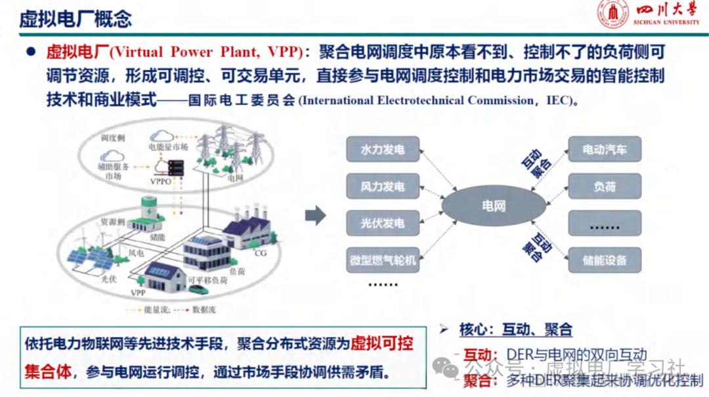

> ## 图片OCR结果
四川大学
虚拟电厂概念
SICHUAN UNIVERSITY
虚拟电厂（VirtualPowerPlant，VPP)：聚合电网调度中原本看不到、控制不了的负荷侧可
调节资源，形成可调控、可交易单元，直接参与电网调度控制和电力市场交易的智能控制
技术和商业模式
国际电工委员会（InternationalElectrotechnicalCommission，IEC）。
调度侧
电能量市场
水力发电
电动汽车
辅助服务
市场
VPPO
风力发电
负荷
电网
资源侧
光伏发电
储能
风电
微型燃气轮机
储能设备
负荷
光伏
可平移负荷
VPP
能量流：数据流
核心：互动、聚合
依托电力物联网等先进技术手段，聚合分布式资源为虚拟可控
互动：DER与电网的双向互动
集合体，参与电网运行调控，通过市场手段协调供需矛盾。
田
习社
聚合：多种DER聚集起来协调优化控制

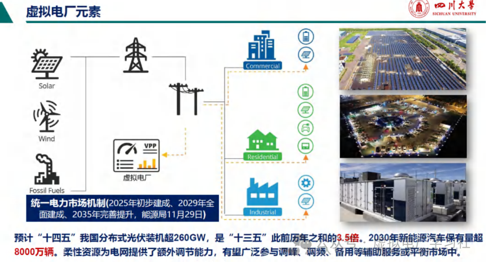

> ## 图片OCR结果
四川大学
虚拟电厂元素
SICHUANUNTVERSITY
Commercial
口
VPP
Residential
三山
虚拟电厂
Fossil Fuels
统一电力市场机制（2025年初步建成、2029年全
面建成、2035年完善提升，能源局11月29日）
Industrial
预计“十四五”我国分布式光伏装机超260GW，是“十三五”此前历年之和的3.5倍。2030年新能源汽车保有量超
8000万辆。柔性资源为电网提供了额外调节能力，有望广泛参与调峰、调频、备用等辅助服务或平衡市场中。

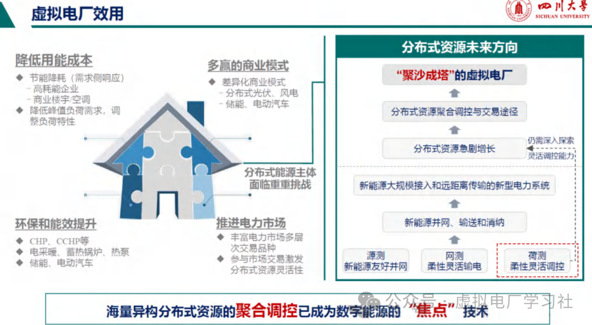

> ## 图片OCR结果
四川大学
虚拟电厂效用
SICHUAN UNIVERSITY
分布式资源未来方向
降低用能成本
多赢的商业模式
节能降耗（需求侧响应）
“聚沙成塔”的虚拟电厂
差异化商业模式
高耗能企业
分布式光伏、风电
商业楼宇/空调
储能、电动汽车
降低峰值负荷需求，调
分布式资源聚合调控与交易途径
整负荷特性
仍需深入探索
分布式资源急剧增长
灵活调控能力
分布式能源主体
面临重重挑战
新能源大规模接入和远距离传输的新型电力系统
环保和能效提升
推进电力市场
新能源并网、输送和消纳
CHP、CCHP等
丰富电力市场多层
次交易品种
电采暖、蓄热锅炉、热泵
参与市场交易激发
源测
网测
荷测
储能、电动汽车
分布式资源灵活性
新能源友好并网
柔性灵活输电
柔性灵活调控
虚拟电厂学力社
海量异构分布式资源的聚合调控已成为数字能源的

页数太多，不在此一一展示，大家可以自行下载学习。

> ## 图片OCR结果
公众号·虚拟电厂学习社

> ## 图片OCR结果
虚拟电厂市场发展近况与盈利模式实践.pptx
2025-04-30 15:18
长三角虚拟电厂发展现状分析报告.pdf
2025-04-30 15:18
云管边端架构下虚拟电厂资源集群与协同调控研究综述及展望.pdf
2025-04-30 15:18
盈利模式大拆解，虚拟电厂拓宽收益边界.pdf
2025-04-30 15:18
云管边端架构下虚拟电厂资源集群与协同调控研究.pdf
2025-04-30 15:18
虚拟电厂-全方位受益电改的服务商.pdf
2025-04-30 15:18
虚拟电厂技术和商业模式研究.pdf
2025-04-30 15:17
虚拟电厂一
能源互联网的终极组态---艾芊.pdf
2025-04-30 15:17
虚拟电厂关键技术和运营模式探讨一—纪陵.pdf
2025-04-30 15:15
虚拟电厂技术在电力市场中的应用与效益分析.pptx
2025-04-30 15:15
虚拟电厂发展建议系统规划、市场参与与电力需求预测.pptx
2025-04-30 15:15
虚拟电厂的概念及可控性.pdf
2025-04-30 15:14
公众号·虚拟电厂学习社

虚拟电厂有很多厉害的功能。从参与系统调度运行方面来说，它能根据配电网系统运营商的调控指令，主动管理需求侧的分布式资源，缓解配电网阻塞和台区电压抬升这些问题，让配电网能安全稳定运行，还能提高区域的自治水平，让分布式能源能更好地被利用。比如说，有的虚拟电厂能在调度周期内灵活调整负荷，实现削峰填谷，让风电更好地被消耗掉；还有的能通过构建模型，消除配电网线路过载的问题。
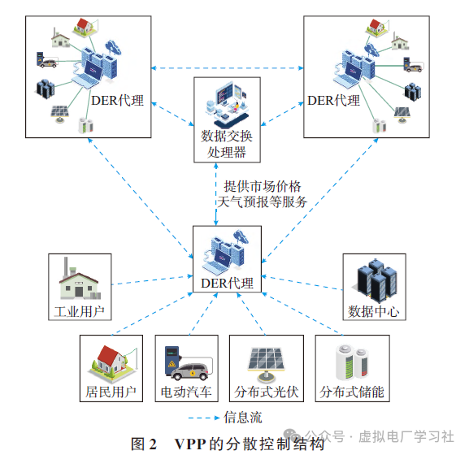

> ## 图片OCR结果
DER代理
DER代理
ML
数据交换
处理器
提供市场价格
天气预报等服务
DER代理
工业用户
数据中心
居民用户
电动汽车
分布式光伏
分布式储能
--→信息流
图2
VPP的分散控制结构号·虚拟电厂学习社

从市场交易方面来说，虚拟电厂聚合的多元化资源让它有了不一样的特性，能参与各种电力市场交易，像能量市场、调峰调频备用辅助服务市场等等。不同的市场有不同的规则和要求，虚拟电厂都能应对。
三、国内外的实践：虚拟电厂的探索之旅
国内外很多地方都在探索虚拟电厂的应用，有不少典型的示范工程。 在欧洲，VPP 发展得比较早也比较成熟。像 FENIX 项目，它把光伏、风电、小水电、生物质能电站、燃料电池、热电联产这些资源都聚合起来，每年能让系统耗气量减少 1% - 3%，电力行业单位千瓦负荷年均二氧化碳排放量减少 7.5kg。Next - Kraftwerke 项目也很厉害，截至 2022 年 4 月，联网发电能力超 10GW，其中太阳能发电占比超过 60%，还在德国二次调频市场占了 10% 的份额。它通过智能控制平台 NEMOCS 把 13000 多个工厂连起来控制，在不同的电力交易中心进行全天候交易。WEB2ENERGY 项目则有两种控制策略，一种能根据市场和资源状态自动调控，另一种通过提前规划，生成电能消费参考曲线和虚拟交通灯时段，在试点项目的第 1 个月，就成功转移了 3% 的负荷，极端情况下能把 100% 的负荷转移到合适的时段，平均削减约 8% 的峰值功率。
澳大利亚的 AGL 能源公司的 VPP 主要用的是用户侧储能，以后还打算加入屋顶光伏、电动汽车、工商业负荷等。这个项目在南澳大利亚州的家庭和企业里装了 1000 个电池，能提供 5MW 的峰值容量，到第一阶段结束，已经有超过 300kW 的储能能力了，还能在澳大利亚国家电力市场 5 分钟的结算交易间隔内进行虚拟充电或放电。
美国的 Autogrid 项目聚合了储能系统、热电联产、分布式光伏、电动汽车等资源。在 2021 年夏季，它被调用了 1800 次，电网压力大的时候，能提供超过 5000MW 的容量和 37GW・h 的电能。它通过 Autogrid Flex 平台，能对几百万个分布式能源资产进行预测、优化和实时控制。
咱们中国也没落后，在很多地方开展了试点。江苏的大规模源网荷友好互动系统，把大用户、燃煤电厂可中断辅机、大型储能电站、智慧照明、分散式空调等资源聚合起来，毫秒级控制总容量达到 2.6GW，控制对象有 2078 户，相当于 4 台百万千瓦火电机组，还节省了 126.4 亿元投资。上海黄浦 VPP 项目利用商业写字楼、储能电站、电动汽车等资源，在 2021 年 5 月的两天里，调节电网负荷 562MW，消纳清洁能源 1236MW・h，减少碳排放约 336t，初步建成了约 1GW 的灵活调节能力。河北的电力物联网 VPP 示范工程接入了楼宇、数字中心、电动汽车、电蓄热锅炉等 11 类灵活性资源，实时接入约 160MW 的资源，覆盖了张家口、秦皇岛和廊坊 3 个地市。
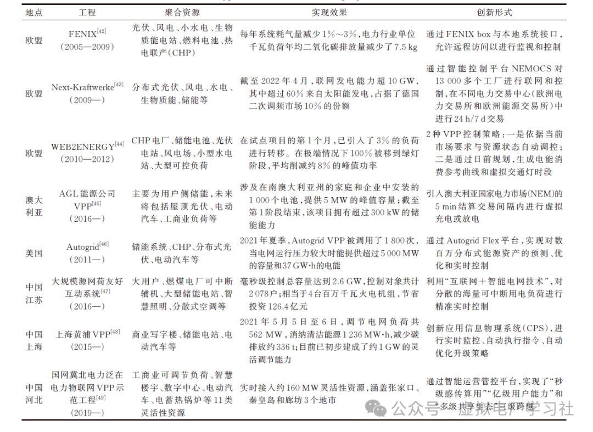

> ## 图片OCR结果
地点
工程
聚合资源
实现效果
创新形式
光伏、风电、小水电、生物
FENIX(42]
每年系统耗气量减少1%~3%，电力行业单位
通过FENIXbox与本地系统接口，
欧盟
质能电站、燃料电池、热
(2005—2009)
千瓦负荷年均二氧化碳排放量减少了7.5kg
允许远程访问以进行监视和控制
电联产（CHP）
通过智能控制平台NEMOCS对
Next-Kraftwerke[43]
截至2022年4月，联网发电能力超10GW，
13000多个工厂进行联网和控
分布式光伏、风电、水电、
欧盟
(2009—)
其中超过60%来自太阳能发电，占据了德国
制，在不同电力交易中心（欧洲电
生物质能、储能等
二次调频市场10%的份额
力交易所和欧洲能源交易所）中
进行24h/7d交易
2种VPP控制策略：一是依据当前
CHP电厂、储能电池、光伏
在试点项目的第1个月，已引人了3%的负荷
WEB2ENERGY[44]
市场要求与资源状态自动调控；
欧盟
电站、风电场、小型水电
(2010—2012)
进行转移。在极端情况下100%被移到绿灯
二是通过日前规划，生成电能消
站、大型可控负荷
阶段，平均削减约8%的峰值功率
费参考曲线和虚拟交通灯时段
AGL能源公司
涉及在南澳大利亚州的家庭和企业中安装的
澳大
主要为用户侧储能，未来
引人澳大利亚国家电力市场(NEM)的
VPp[45]
1000个电池，提供5MW的峰值容量；截至
将包括屋顶光伏、电动
5min结算交易间隔内进行虚拟
利亚
(2016—)
第1阶段结束，该项目拥有超过300kW的储
汽车、工商业负荷等
充电或放电
能能力
2021年夏季，AutogridVPP被调用了1800次，
Autogrid[46]
储能系统、CHP、分布式光
通过AutogridFlex平台，实现对数
美国
当电网运行压力较大时能提供超过5000MW
百万分布式能源资产的预测、优
(2011—)
伏、电动汽车等
的容量和37GW·h的电能
化和实时控制
中国
大规模源网荷友好
大用户、燃煤电厂可中断
毫秒级控制总容量达到2.6GW，控制对象共计
利用“互联网十智能电网技术”，对
江苏
互动系统47]
辅机、大型储能电站、智
2078户；相当于4台百万千瓦火电机组，节省
分散的海量可中断用电负荷进行
(2016—)
慧照明、分散式空调等
投资126.4亿元
精准实时控制
2021年5月5日至6日，调节电网负荷共
创新应用信息物理系统（CPS），进
中国
上海黄浦VPP[48]
商业写字楼、储能电站、电
562MW，消纳清洁能源1236MW·h，减少碳
上海
(2015—)
行实时监控、自动执行指令、自动
动汽车等
排放约336t；目前已初步建成了约1GW的灵
优化升级策略
活调节能力
国网冀北电力泛在
工商业可调节负荷、智慧
通过智能运营管控平台，实现了“秒
中国
电力物联网VPP示
楼宇、数字中心、电动汽
实时接人约160MW灵活性资源，涵盖张家口，
级感传算用”“亿级用户能力"和
河北
范工程[49]
车、电蓄热锅炉等11类
秦皇岛和廊坊3个地市
公众号多级盘电级跨习社
(2019—)
灵活性资源

这些示范工程各有特色，欧美地区在商业模式、市场生态链和智能管控平台建设方面有很多值得我们学习的地方；咱们中国的试点虽然在响应电网调度指令方面表现很好，但也面临商业模式单一、市场参与率低、用户主动响应意愿不高等问题，在关键技术上还有提升的空间。
四、虚拟电厂的商业模式：赚钱和运营的门道
商业模式就像是虚拟电厂的 “赚钱指南”，它主要包括价值主张、资源组成、经营模式和成本收益这几个部分。
虚拟电厂的价值主张有两个重点。一方面，它能给系统运营商提供高效安全、快速爬坡的灵活性，就像给电力系统打了一针 “强心剂”，让它能更稳定地运行；另一方面，它能给那些海量、分散、多元、异构的分布式资源创造参与系统调节或市场交易的机会，让大家都能赚到钱。
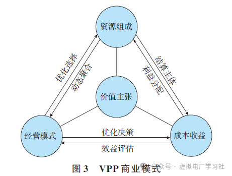

> ## 图片OCR结果
资源组成
优化选择
动态聚合
结算主体
利益分配
价值主张
经营模式
优化决策
成本收益
效益评估
VPP商业模式号·虚拟电厂学习社

虚拟电厂的资源组成就是它聚合的那些分布式电源、储能、可控负荷等资源。不同的资源组合方式，就像不同的队员组队，会形成不同的联盟，这决定了它的经营模式，也是它参与市场交易和提供服务的基础，同时还影响着成本收益。
经营模式方面，如果虚拟电厂里分布式电源和可控负荷占比高，它就像个 “发电小能手”，对外呈现 “电厂” 特性。这时候，它可以参与不同时间尺度的市场交易，像中长期市场或者现货市场，买卖能量或者提供辅助服务。它会根据资源的成本特性，向市场报出竞标价格和出力范围，参与集中竞价，中标后就能按照出清电价和成交量获得收益。它也能响应系统调度指令，为输电系统运营商提供实时功率平衡服务，或者为配电网系统运营商提供阻塞管理、电压控制等服务。
要是虚拟电厂里传统负荷占比高，它就更像个 “用电大户”，对外呈现 “负荷” 特性。这时候，如果它执行需求响应，也能参与辅助服务市场交易或者响应调度指令；要是不执行需求响应，它可以和配电网系统运营商合作，协同调度分布式资源，减少分布式电源对配电网的影响，或者和零售商一起优化购电策略，降低购电成本。
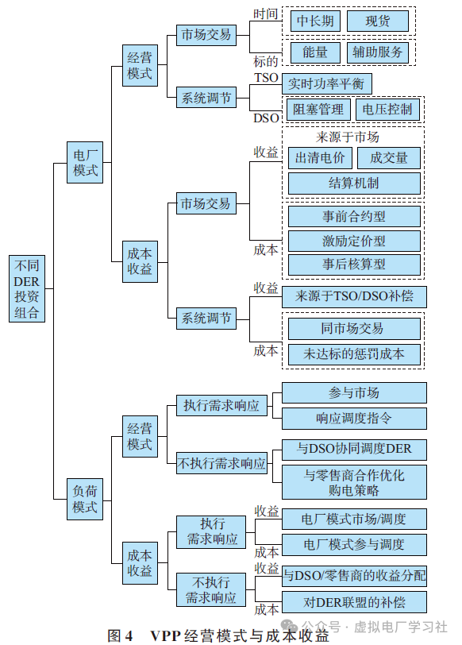

> ## 图片OCR结果
时间！
中长期
现货
市场交易
经营
能量
辅助服务
标的！
模式
TSO
实时功率平衡
系统调节
阻塞管理
电压控制
DSO!
来源于市场
电厂
收益！
出清电价
成交量
模式
结算机制
市场交易
事前合约型
激励定价型
成本
成本！
不同
收益
事后核算型
DER
收益
投资
来源于TSO/DSO补偿
组合
系统调节
同市场交易
成本
未达标的惩罚成本
参与市场
执行需求响应
响应调度指令
经营
模式
与DSO协同调度DER
不执行需求响应
与零售商合作优化
负荷
购电策略
模式
收益
执行
电厂模式市场/调度
需求响应
成本
电厂模式参与调度
成本
收益
收益
与DSO/零售商的收益分配
不执行
需求响应
对DER联盟的补偿
成本
图4

成本收益也和经营模式有关。当虚拟电厂作为 “电厂” 参与市场交易时，收益来自市场，不过它得给联盟里的分布式资源支付补偿金，这就是成本。补偿方式有好几种，事前合约型就是提前签好合同，规定好补偿单价和机制；激励定价型是提前公布激励单价，让大家主动响应，事后按这个价格补偿；事后核算型是根据联盟成员的贡献度来补偿。当它为系统运营商提供服务时，收益来自运营商的奖励或补偿，但要是响应没达到要求，还会面临惩罚成本。当它作为 “负荷” 执行需求响应时，收益和成本情况和作为 “电厂” 参与辅助服务市场类似；不执行需求响应时，收益来自和配电网系统运营商或零售商的合作，成本就是给联盟的经济补偿。
五、关键技术揭秘：让虚拟电厂聪明起来的 “法宝”
虚拟电厂要想好好运营，离不开一系列关键技术，主要包括状态感知与灵活聚合、信息预测与容量估计、市场交易与优化决策、补偿结算与效益评估这几个方面。
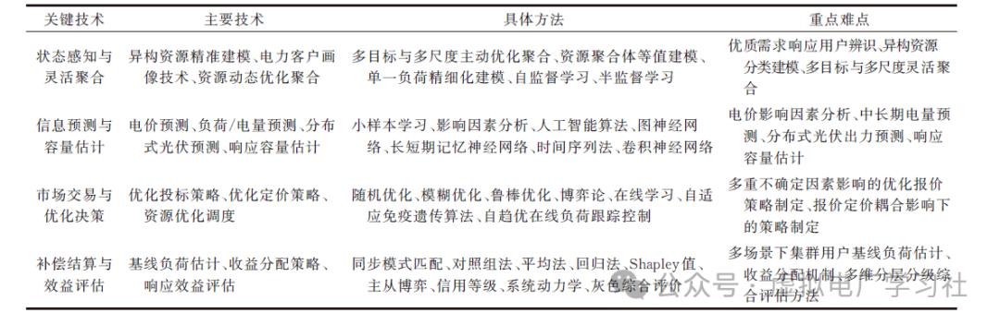

> ## 图片OCR结果
关键技术
主要技术
具体方法
重点难点
优质需求响应用户辨识、异构资源
状态感知与
异构资源精准建模、电力客户画
多目标与多尺度主动优化聚合、资源聚合体等值建模、
灵活聚合
分类建模、多目标与多尺度灵活聚
像技术、资源动态优化聚合
单一负荷精细化建模、自监督学习、半监督学习
合
电价影响因素分析、中长期电量预
信息预测与
电价预测、负荷/电量预测、分布
小样本学习、影响因素分析、人工智能算法、图神经网
测、分布式光伏出力预测、响应
容量估计
式光伏预测、响应容量估计
络、长短期记忆神经网络、时间序列法、卷积神经网络
容量估计
多重不确定因素影响的优化报价
市场交易与
优化投标策略、优化定价策略、
随机优化、模糊优化、鲁棒优化、博弈论、在线学习、自适
策略制定、报价定价耦合影响下
优化决策
资源优化调度
应免疫遗传算法、自趋优在线负荷跟踪控制
的策略制定
多场景下集群用户基线负荷估计、
补偿结算与
基线负荷估计、收益分配策略、
同步模式匹配、对照组法、平均法、回归法、Shapley值、
收益分配机制多维分层分级综十
效益评估
响应效益评估

（一）状态感知与灵活聚合：摸清资源 “脾气”
状态感知与灵活聚合就像是给虚拟电厂装上了 “千里眼” 和 “顺风耳”，能让它清楚地了解分布式资源的运行情况，还能把这些资源合理地聚合起来。
这里面的电力客户画像技术很有意思，它能根据用户的各种信息，像社会属性、生活习惯、用能行为等，给用户贴上各种标签，比如年龄、消费能力、家庭人口、用能态度、负荷电量信息等。通过这些标签，虚拟电厂就能更了解用户，找到那些参与意愿高、需求响应潜力大的优质用户，还能根据用户特点制定个性化的需求响应合约，提高用户的参与积极性。现在常用的客户画像方法是机器学习，半监督学习因为需要的有标签样本少，以后可能会更常用，但要想提高画像精度，还得深入挖掘用户数据的潜在价值。
异构资源精准建模也很重要。虚拟电厂里的资源种类多、特性不一样，传统的负荷描述方法不太适用。所以，一方面要针对单一资源，考虑它的物理属性、用户意愿、舒适度需求等，建立精细化的模型；另一方面要从资源集群的角度，研究它们的泛化特征和抽象等效性，建立等值建模方法，这样才能为电网调控提供更准确的模型支持。
资源动态优化聚合就是把不同的分布式资源，根据电网调控和市场参与的不同需求，像搭积木一样组合起来，形成可调度的资源池。不同的资源有不同的特点，有的是定量补偿型，根据激励信号自己决定响应，不确定性大；有的是权益让渡型，把控制权交给虚拟电厂，响应比较快；还有分布式储能，能按照计划实时调整充放电。虚拟电厂要综合考虑这些资源的调节能力、时段、不确定性和成本等因素，做出最优决策。
（二）信息预测与容量估计：预知未来的 “水晶球”
信息预测与容量估计技术能让虚拟电厂提前了解市场和自身资源的情况，就像有个 “水晶球” 能预知未来一样。
市场电价预测很关键，准确预测电价能帮助虚拟电厂在市场交易中精准投标报价，实现利润最大化。电价预测可以按照时间尺度分为中长期预测、短期预测和超短期预测，按照内容分为确定性预测和概率性预测。因为电价受很多因素影响，变化快又不确定，概率预测能提供更多信息，降低决策风险。常用的预测方法有时间序列法和机器学习模型，随着新能源的发展，全面分析电价影响因素并准确预测变得越来越重要。
负荷与电量预测也很重要，虚拟电厂参与市场交易、调度运行都离不开它。不同时间尺度的预测对虚拟电厂的决策有不同的指导意义。中长期预测一般用传统统计学方法，但因为数据信息少，精度不太够，现在很多人在研究怎么利用多时间尺度信息提高精度。短期和实时预测则可以用深度学习算法，效果还不错。而且，虚拟电厂的负荷与电量预测是针对用户集群的，要考虑用户的负荷模式差异，比城市电网级和地区电网级的预测更精细。
分布式光伏预测也有挑战。随着分布式光伏的快速发展，它的随机波动特性给虚拟电厂带来了麻烦。传统的集中式光伏预测方法不能直接用在分布式光伏上，因为分布式光伏数据少，和集中式光伏出力特性也不一样，还有很多表后分布式光伏没有单独表计。所以，要先把用户负荷和表后光伏解耦，再分别预测，同时还要考虑各台区间分布式光伏的时空相关性。
响应容量估计是个新兴领域，它能回答虚拟电厂里的柔性资源在什么时段能提供多少灵活性的问题，对投标策略制定很重要。现在的研究大多从负荷物理特性出发，但计算出来的理论响应容量比实际可用响应容量大。要准确估计响应容量，还得在数学模型和数据驱动算法上下功夫，不过这面临着很多难点，比如影响因素复杂、数据不足、储能资源的时序耦合特性等。
（三）市场交易与优化决策：在市场中 “精打细算”
市场交易与优化决策就像是虚拟电厂在市场里的 “智慧大脑”，能让它做出最优的决策，实现利益最大化。
优化投标策略要考虑很多不确定因素，比如市场价格、用户响应行为等。常用的方法有随机优化、模糊优化和鲁棒优化。随机优化通过模拟大量样本处理不确定性；模糊优化基于模糊逻辑，能根据不准确的信息做出判断；鲁棒优化则更保守，考虑最坏的情况。这些方法可以结合使用，优势互补。
优化定价策略也很关键，虚拟电厂要根据系统运营商的补偿价格制定用户侧激励价格，价格定得太高或太低都不行。价格低了，用户参与积极性不高；价格高了，虚拟电厂成本又会增加。现在常用博弈论、在线学习等方法来研究定价问题，但目前大多把投标策略和定价策略分开考虑，没有考虑它们之间的联动，以后还需要进一步研究。
资源优化调度是在市场出清后，根据中标结果优化各类分布式资源的调控策略。从不同角度可以把优化调度方法分成不同类型，比如从处理不确定性问题的方式、求解方法、调控模式、优化目标等。不同的优化目标有不同的侧重点，有的追求经济效益，有的注重可靠性，还有的是综合考虑多个目标。
（四）补偿结算与效益评估：算好账，评好效
补偿结算与效益评估是虚拟电厂运营的 “财务管家” 和 “体检医生”，能算好经济账，还能评估运营效果。
基线负荷估计是确定用户在不参与需求响应时的用电负荷，这是需求响应补偿结算的依据。但用户参与响应后，基线负荷就没办法直接测量了，只能估计。它和负荷预测有点像，但也有区别，负荷预测是预测未来，基线负荷估计可以事前也可以事后，而且基线负荷真实值没办法测量，只能通过虚拟需求响应事件验证估计精度。常用的个体基线负荷估计方法有平均法、回归法、对照组法、同步模式匹配法等，集群基线负荷估计目前大多是把个体估计值直接累加，以后可以利用图神经网络技术提升估计精度。
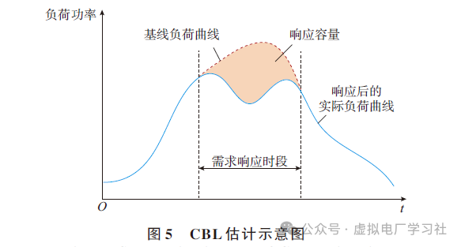

> ## 图片OCR结果
负荷功率
基线负荷曲线
响应容量
响应后的
实际负荷曲线
需求响应时段
1
图5
CBL估计示意图公众号·虚拟电厂学习社

收益分配策略关系到用户参与需求响应的积极性。虚拟电厂和用户是合作关系，一起参与市场交易，但也存在利润分配的问题。常用博弈论来研究收益分配，现在有很多分配机制，像 Shapley 值法、均分法等，目的是保证用户的积极性和 “虚拟联盟” 的稳定性。
综合效益评估是在市场交易结束后，对虚拟电厂的整体效益进行评估，包括技术指标完成情况和经济效益分析。通过构建量化评价指标体系，可以实现整体和个体效益的分级评估，这对政府制定政策、虚拟电厂改进运营都有帮助。常用的评估方法有系统动力学、信用等级、灰色综合评价等。
六、未来展望：虚拟电厂的新征程
未来的新型电力系统有很多新特点，像广泛互联、智能互动、灵活柔性、低碳经济等。虚拟电厂和这些特点很契合，能为新型电力系统的建设发挥重要作用。但随着系统结构的变化，虚拟电厂也面临着新的挑战和机遇。
在复杂场景下的基线负荷估计方面，现在的估计方法在未来复杂的用能场景下可能会有误差，而且估计结果验证困难。所以，需要进一步研究更准确的估计方法和验证方法，还可以探索基于准线的商业模式，提高虚拟电厂的利用率。
为了适应高比例新能源和电力电子设备接入的需求，虚拟电厂需要提供更多元的辅助服务，比如转动惯量、爬坡、稳定切负荷等。这就需要设计新的商业模式，关注能提供这些服务的分布式资源，加强相关技术的研究。
中长期容量市场的建立对虚拟电厂来说是个好机会。虚拟电厂参与容量市场交易能获得稳定收入，丰富经营模式，还能为新能源发电并网提供灵活容量支持。
综合需求响应能让虚拟电厂更好地利用分布式资源，考虑冷 - 热 - 电 - 气的相互转化，激发需求侧资源的灵活性，这也是未来的一个重要发展方向。
随着虚拟电厂规模的扩大，交易平台和信息平台的问题越来越突出。区块链技术可以解决这些问题，它能提供公平可信、成本低廉的交易平台，还能让信息更透明，有利于提升虚拟电厂的运营收益，促进分布式光伏的消纳。
在碳减排的大背景下，虚拟电厂参与电碳联合市场交易是个新趋势。这就要求虚拟电厂具备考虑碳排放的优化运营技术，能分析碳减排效益、核算碳资产，进一步挖掘绿色低碳价值，丰富商业模式，促进节能减排。
七、结语：虚拟电厂的无限可能
虚拟电厂作为新型电力系统中的重要一环，通过高效聚合和协同调度分布式资源，为提升电力系统运行灵活性做出了重要贡献。它的商业模式和关键技术不断发展和完善，未来也有着广阔的发展前景。虽然现在还面临一些挑战，但随着技术的进步和研究的深入，虚拟电厂一定能在能源领域发挥更大的作用，为我们的能源转型和可持续发展注入强大动力，让我们的电力供应更加稳定、高效、绿色。在未来，虚拟电厂有望成为能源管理领域的中流砥柱，深度参与到能源生产、分配和消费的各个环节。
从更宏观的角度看，虚拟电厂的发展不仅关乎电力系统自身的优化，还将带动整个能源产业的变革。它能够促进不同能源之间的融合与协同，比如推动电、热、冷等多种能源形式的综合利用，构建更加高效的综合能源系统。这不仅可以提高能源利用效率，减少能源浪费，还能降低能源供应的成本，让能源服务更加经济实惠。
同时，虚拟电厂的广泛应用还将对相关产业产生积极的辐射效应。在技术研发方面，会带动通信技术、信息技术、控制技术等多领域的创新与发展，催生更多先进的技术成果应用于能源领域。在市场层面，虚拟电厂的发展将活跃电力市场，吸引更多的市场主体参与其中，促进市场竞争，提升市场的活力与效率。此外，还将创造大量的就业机会，从技术研发、系统运维到市场运营等各个环节，都需要专业人才的参与。
对于普通用户而言，虚拟电厂带来的好处也是实实在在的。一方面，用户可以通过参与虚拟电厂的需求响应项目，获得一定的经济补偿，实现自身利益的增加。另一方面，虚拟电厂有助于提升电力供应的稳定性和可靠性，减少停电事故的发生，为用户提供更加优质的电力服务。而且，随着虚拟电厂在促进新能源消纳方面发挥更大作用，用户使用的 “绿色电力” 比例将不断提高，这对于环境保护和可持续发展具有重要意义。
不过，要充分实现虚拟电厂的这些潜力，还需要各方共同努力。政府应继续加大政策支持力度，完善相关的政策法规和标准体系，为虚拟电厂的发展创造良好的政策环境。科研机构和企业要持续投入研发力量，攻克关键技术难题，推动技术创新和应用。同时，还需要加强市场机制的建设，培育成熟的市场环境，引导更多的市场主体积极参与虚拟电厂的建设和运营。
总之，虚拟电厂的发展前景十分广阔，它承载着能源转型和可持续发展的重要使命。在未来的能源画卷中，虚拟电厂将描绘出更加绚丽多彩的篇章，为我们的生活和社会发展带来更多的惊喜和可能。让我们共同期待虚拟电厂在新型电力系统建设中大放异彩，助力实现能源领域的绿色、低碳、可持续发展目标。

## NLP概括

本文主要探讨了虚拟电厂这一概念及其在能源转型过程中的重要性。文章指出，随着能源绿色低碳转型的推进，许多企业正在上马虚拟电厂业务。虚拟电厂是一种通过先进通信、量测、控制技术和软件系统把分布式电源、储能、可控负荷等资源聚集起来的虚拟联合体，能有效提升电力系统的灵活性，满足配电网系统的功率平衡需求，并参与电力市场交易。

虚拟电厂的优势在于其能根据配电网系统运营商的调控指令，主动管理需求侧的分布式资源，缓解配电网阻塞和台区电压抬升等问题，提高区域自治水平，更好地利用分布式能源。此外，虚拟电厂还能参与多种电力市场交易，如能量市场、调峰调频备用辅助服务市场等，从而获取收益。

然而，虚拟电厂的商业模式和发展仍面临一些挑战。例如，如何确保分布式资源的有效响应和利用，以及如何实现虚拟电厂的商业化运作和盈利模式。此外，虚拟电厂在处理复杂场景下的基线负荷估计方面还需进一步研究，以提高估计精度和准确性。

总的来说，虚拟电厂作为新型电力系统中的重要组成部分，将在能源转型过程中发挥积极作用。随着技术进步和研究深化，虚拟电厂有望成为能源管理领域的中流砥柱，推动能源行业的变革，为实现能源转型和可持续发展贡献力量。

---

